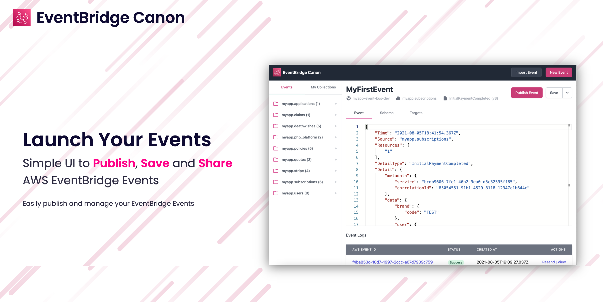
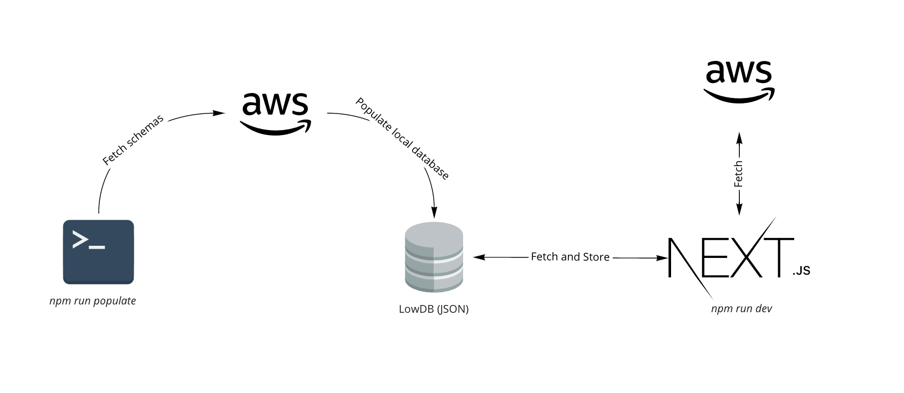
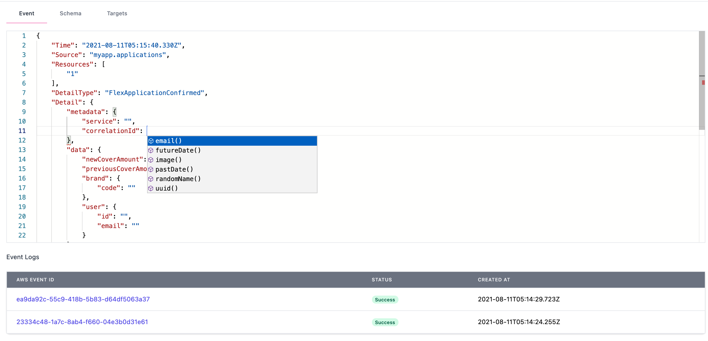
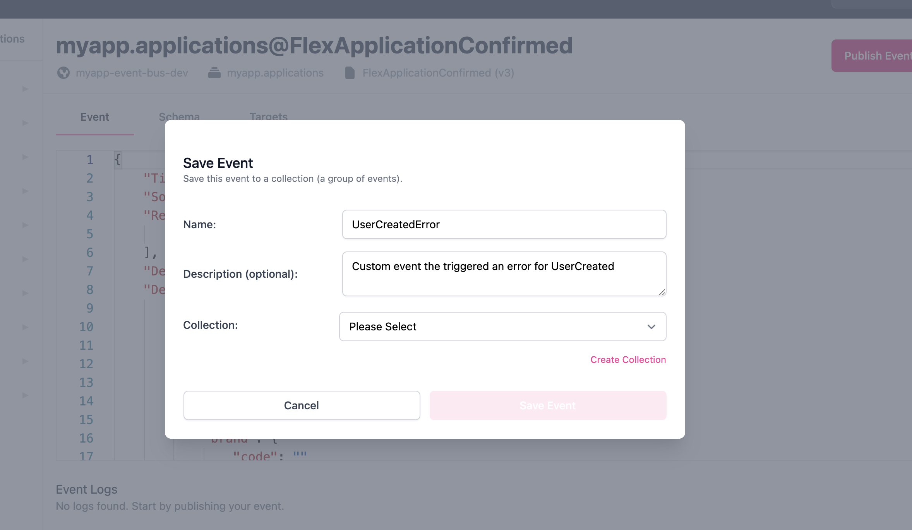
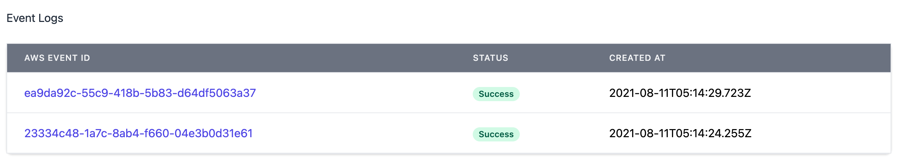
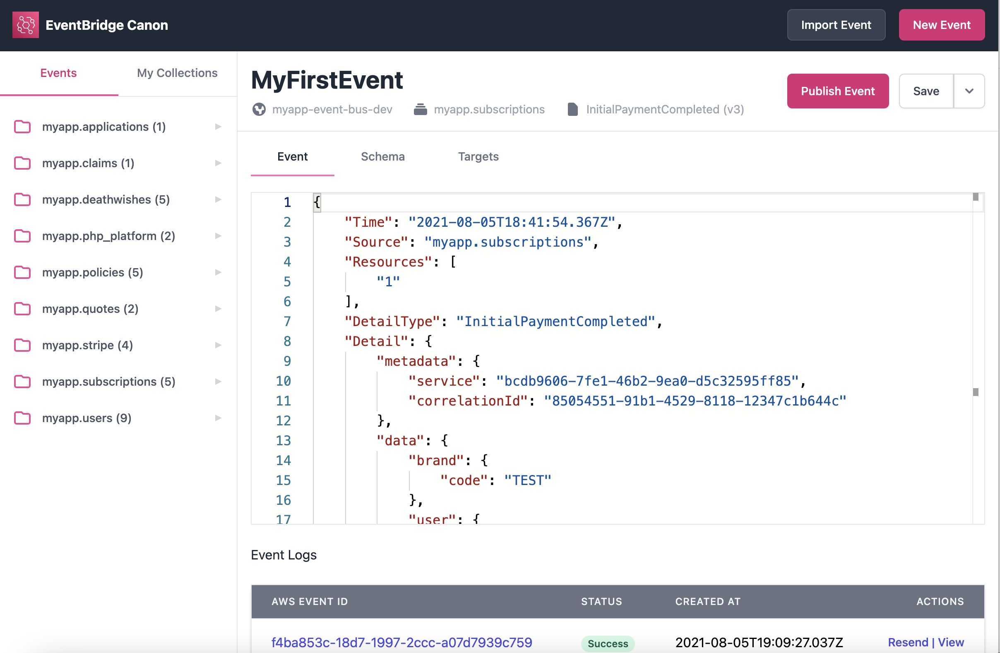

<h2>AWS EventBridge Canon 🗺</h2>

Simple UI to Publish, Save and Share AWS EventBridge Events</>

[![MIT License][license-badge]][license]
[![PRs Welcome][prs-badge]][prs]

[![Watch on GitHub][github-watch-badge]][github-watch]
[![Star on GitHub][github-star-badge]][github-star]

  <h3>Features: Publish your events in seconds, Custom Editor to create and publish events, import/export events for your team, Prepopulated events, Fake data, Save events for future in collections, navigate and explore sources and events, and more...</h3>

[Read the Docs](https://eventbridge-canon.netlify.app/) | [Edit the Docs](https://github.com/boyney123/eventbridge-canon-docs)

# The problem

I'm a huge fan of [AWS EventBridge](https://aws.amazon.com/eventbridge/) and the ability it can give us to quickly create Event Driven Architectures and help businesses scale and grow.

Like most things, over time you get more and more events you need to manage.

So it's important to understand your event schema and also have the relevant tooling to help you stay productive.

> **EventBridge Canon** was developed to help myself and hopefully others manage and publish events into EventBridge.

I found myself wanting to easily create Events and publish them into EventBridge and reuse previous events I have sent. I stored events locally on my machine, but wanted a tool to help my own productivity.

I wanted to create a solution that gives developers around the world the tools to **save events**, **re-publish** events and **manage events** whilst in development.

# This solution

**EventBridge Canon** is a GUI that was built to help developers publish EventBridge events.

You could split **EventBridge Canon** into these parts.

1. AWS Integration (Fetching data from AWS)
2. LowDB (Storing data locally)
3. NextJS Application (Canon itself)

You can read more on [how it works on the website](https://eventbridge-canon.netlify.app/docs/how-it-works)

# Getting Started

You should be able to get setup within minutes if you head over to our documentation to get started 👇

➡️ [Get Started](https://eventbridge-canon.netlify.app/)

# Examples

Here are some screenshots of examples of what EventBridge Canon looks like.

## Event Editor

## Saving Events

## Event Logs

## Editor with Collections

# Contributing

If you have any questions, features or issues please raise any issue or pull requests you like. I will try my best to get back to you.

[license-badge]: https://img.shields.io/github/license/boyney123/eventbridge-canon.svg?color=yellow
[license]: https://github.com/boyney123/eventbridge-canon/blob/main/LICENCE
[prs-badge]: https://img.shields.io/badge/PRs-welcome-brightgreen.svg?style=flat-square
[prs]: http://makeapullrequest.com
[github-watch-badge]: https://img.shields.io/github/watchers/boyney123/eventbridge-canon.svg?style=social
[github-watch]: https://github.com/boyney123/eventbridge-canon/watchers
[github-star-badge]: https://img.shields.io/github/stars/boyney123/eventbridge-canon.svg?style=social
[github-star]: https://github.com/boyney123/eventbridge-canon/stargazers

# Sponsor

If you like this project, it would mean the world to me if you could buy me a drink to keep going!

[Sponsor this project](https://github.com/sponsors/boyney123).

# License

MIT.
